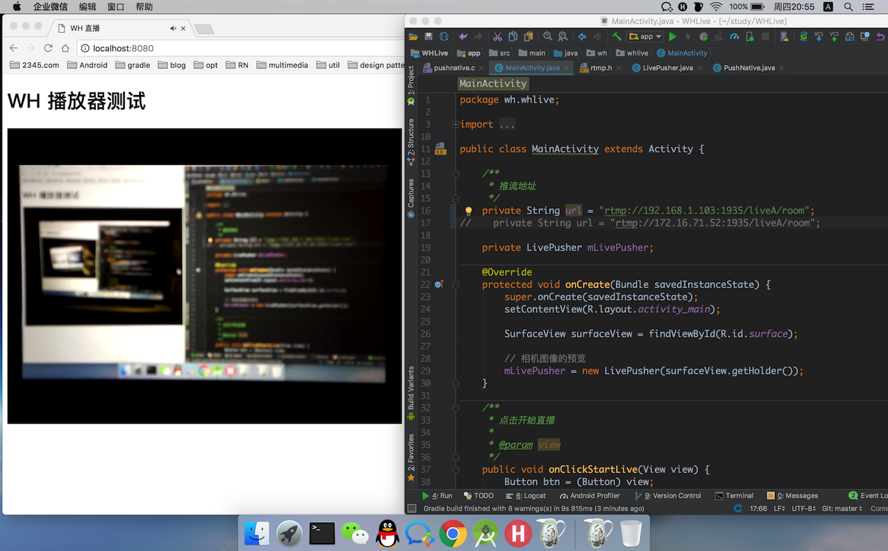
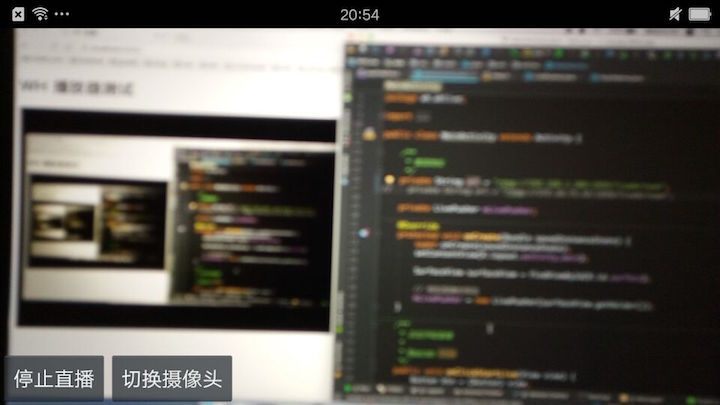

# LIVE_WH 直播知识总结

1. 实现android native层音视频推流
2. cmake编译方式，配合LLDB可实现native层debug，java层与native层代码跳转
3. 相关理论内容

* [直播总结一 FLV文件分析](https://eterualrb.github.io/2017/06/13/%E7%9B%B4%E6%92%AD%E6%80%BB%E7%BB%93%E4%B8%80-FLV%E6%96%87%E4%BB%B6%E5%88%86%E6%9E%90/)
* [直播总结二 AMF编码](https://eterualrb.github.io/2017/06/16/%E7%9B%B4%E6%92%AD%E6%80%BB%E7%BB%93%E4%BA%8C-AMF%E7%BC%96%E7%A0%81/)
* [直播总结三 H264](https://eterualrb.github.io/2017/06/21/%E7%9B%B4%E6%92%AD%E6%80%BB%E7%BB%93%E4%B8%89-H264/)
* [直播总结四 NALU](https://eterualrb.github.io/2017/06/25/%E7%9B%B4%E6%92%AD%E6%80%BB%E7%BB%93%E5%9B%9B-NALU/)
* [直播总结五 RTMP协议](https://eterualrb.github.io/2017/06/30/%E7%9B%B4%E6%92%AD%E6%80%BB%E7%BB%93%E4%BA%94-RTMP%E5%8D%8F%E8%AE%AE/)

4. [Nginx流媒体服务器搭建](https://eterualrb.github.io/2017/07/01/Android%E7%9B%B4%E6%92%AD-Nginx%E6%B5%81%E5%AA%92%E4%BD%93%E6%9C%8D%E5%8A%A1%E5%99%A8%E6%90%AD%E5%BB%BA/)
5. [native层音视频推流代码分析](https://eterualrb.github.io/2017/07/02/Android%E7%9B%B4%E6%92%AD-native%E5%B1%82%E9%9F%B3%E8%A7%86%E9%A2%91%E6%8E%A8%E6%B5%81/)
6. 测试画面

